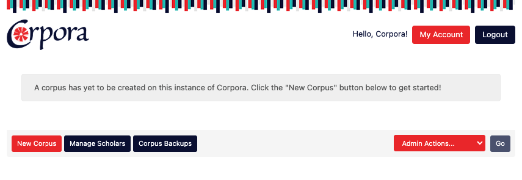
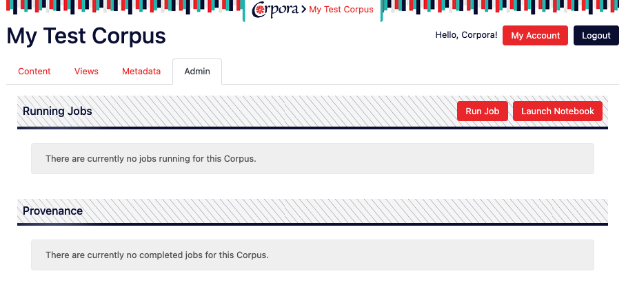
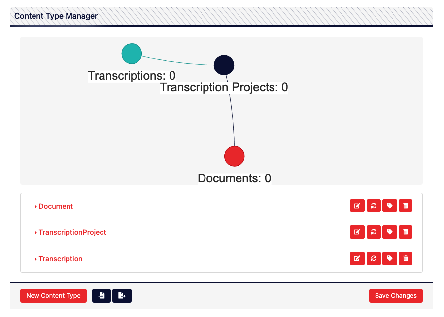
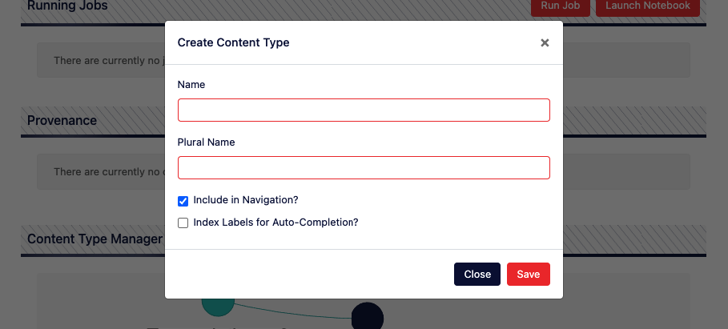
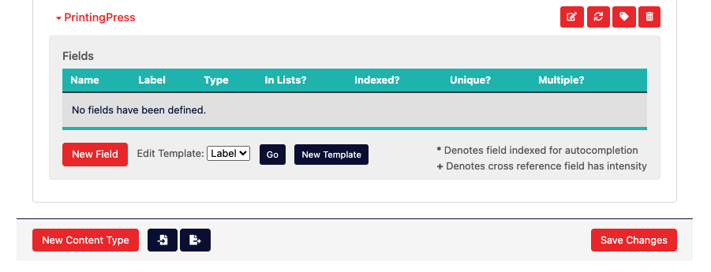
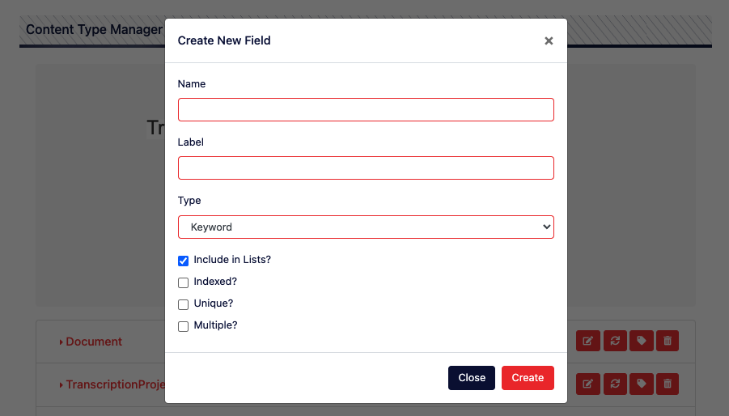
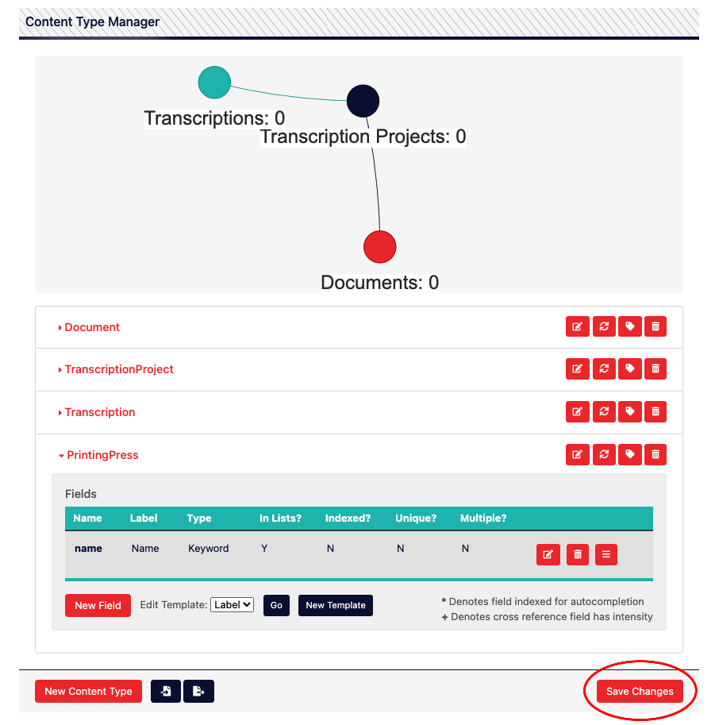
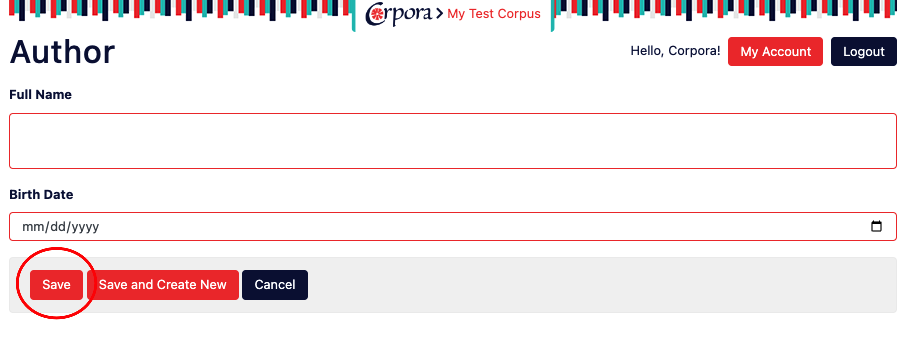

# Corpora

*A Dataset Studio for the Digital Humanities*

## What is Corpora?

Corpora is Digital Humanities (DH) infrastructure—it's intended to be run by academic centers, libraries, or
project teams, and its purpose is to greatly accelerate the development of DH projects by serving as a database, a REST
API, a data collection/curation interface, and a Python-powered asynchronous task queue all wrapped into one. 

Corpora's name is the plural for "corpus" because it happily manages multiple, disparate datasets for a variety of
different projects. On the same instance of Corpora, you can host one project that contains millions of bibliographic
metadata records and another than contains hundreds of thousands of geolocated annotations for images. The limitations
for what you can host with Corpora are determined by your hardware, not the affordances of the software.

Among Corpora's affordances is a web-based interface for defining a data schema that is expected to evolve over time.
This is because it is extremely rare to define a perfect schema for appropriately keeping track of project data on the
first attempt. Projects happen iteratively, and so data schemas should be as effortlessly maleable as possible.

Once a schema has been defined for a project, Corpora dynamically generates web forms for collaborators to enter the
data. It also dynamically generates a read-only REST API for third party applications to query in order to provide, for
instance, a public, front-facing website for that project. Corpora's web interface makes use of this REST API to allow
scholars to search, sort, and explore the connections between their datapoints as they go about building their project.

Finally, Corpora is built to cater to a wide range of users, from scholars with little technical expertise to data
wranglers who want to leverage the power of Corpora's built-in iPython notebooks. Corpora also integrates a fully
asynchronous job queue allowing power users to run long-running jobs (such as optical character recognition, natural
language processing, TEI XML ingestion, etc.) on thousands of records at once.

## Defining Terms

### Corpus

In Corpora, a “corpus” is a dataset particular to an individual project. The most approachable metaphor is to think of a
corpus as a collection of spreadsheets, each containing data about a different kind of thing (like books, authors,
themes, etc), but ultimately all related somehow under the rubric of a project (like a project that collects metadata
about literature produced in the 1890’s in London). Unlike a collection of spreadsheets, however, data living in a
corpus in Corpora has certain features baked in, like the ability for multiple users to log in and collect that data,
the ability to sort and perform full-text searches on the data, the ability for an administrator (or corpus “Editor”)
to add new fields for data on-the-fly, the ability to visualize the data in a network graph, and access to an API for
programmers or researchers to computationally access that data, whether to perform analyses or to serve up a
public-facing frontend website. Also, whereas a spreadsheet that is accessed via Excel or Google Sheets has a hard
limit in terms of the amount of data you can usefully store, Corpora is built to scale up to hold millions of records
while preserving all functionality.

### Content Type

In Corpora, if a corpus is like a database, then a “content type” is like a table in that database. Or to go with the
corpus-as-collection-of-spreadsheets metaphor where each spreadsheet is keeping track of a particular thing (like books,
authors, themes, etc.), a content type is like one of those spreadsheets. In essence, a content type allows you to store
data about a particular thing by allowing you to define it as having a collection of fields (or columns in that
spreadsheet), such as, in the case of a book, fields for things like the author, title, publication date, etc.

### Field

A field belongs to a content type, and using the spreadsheet metaphor, it’s like a column in that spreadsheet in that
it keeps track of a particular kind of data. So if our content type were a Book, then some common fields to describe
that book would be things like author, title, publication date, etc.

When creating fields for a content type, there are several types of field you can choose from, each capable of storing
different kinds of data and providing different kinds of functionality. The table below lists each field type:

| Type            | Description                                                                                                                                                                                                                              | Example Values                                                                                                                                                              | Sortable? | Supported Searches                                                                                                                           |
|-----------------|------------------------------------------------------------------------------------------------------------------------------------------------------------------------------------------------------------------------------------------|-----------------------------------------------------------------------------------------------------------------------------------------------------------------------------| -------- |----------------------------------------------------------------------------------------------------------------------------------------------|
| Keyword         | For storing relatively small (usually textual) values. If you were creating a content type for keeping track of people, you might, for instance, use a keyword field for keeping track of gender.                                        | male, female, transgender, gender neutral, non-binary, agender, pangender, genderqueer, two-spirit, third gender                                                            | Yes | Exact on full value                                                                                                                          |
| Text            | For storing medium sized text content. Maximum size here depends on how Elasticsearch is configured, but approximately a printed page’s worth of text.                                                                                   | “This is the way the world ends / This is the way the world ends / This is the way the world ends / Not with a bang but a whimper.”                                         | Yes | Exact on full value, match, term, phrase, wildcard                                                                                           |
| Large Text      | For storing a large amount of text content, such as the full text of a novel.                                                                                                                                                            | “Call me Ishmael…”                                                                                                                                                          | No | Match, term, phrase, wildcard                                                                                                                |
| HTML            | For storing a large amount of HTML/XML content, such as a full web page or the TEI encoded text of a novel. Searches for content with tags stripped out.                                                                                 | `
<b>This</b> is <i>hypertext</i>!
`                                                                                                                               | No | Match, term, phrase, wildcard                                                                                                                |
| Number          | Whole numbers, positive and negative.                                                                                                                                                                                                    | 42                                                                                                                                                                          | Yes | Exact on full value, range                                                                                                                   |
| Decimal         | Floating point (decimal) numbers, positive and negative.                                                                                                                                                                                 | 3.14159                                                                                                                                                                     | Yes | Exact on full value, range                                                                                                                   |
| Boolean         | True of false.                                                                                                                                                                                                                           | True                                                                                                                                                                        | Yes | Exact                                                                                                                                        |
| Date            | A date and time.                                                                                                                                                                                                                         | July 2nd, 1964                                                                                                                                                              | Yes | Exact on full value, range                                                                                                                   |
| Timespan        | For storing start dates and optional end dates to represent a range of time. Also features an "uncertain" flag that can be set, as well as a granularity value of either `Day`, `Month`, or `Year`.                                      | Start: January 1st, 700; End: December 31st, 1050; Uncertain: True; Granularity: Year. (An example of an uncertain publication date between the 8th and early 11th century) | Yes | Exact on start or end values, range                                                                                                          |
| File            | A digital file uploaded into the corpus file structure.                                                                                                                                                                                  | dissertation.docx                                                                                                                                                           | No | On file path: Exact on full value, match, term, phrase, wildcard                                                                             |
| Git Repo        | The branch of a git repository, cloned into the file structure of the content to which it belongs. Each corpus also has a "repos" property which is a dictionary where the name of the repo is the key and the repo object is its value. | https://github.com/bptarpley/corpora.git                                                                                                                                    | No | None                                                                                                                                         |
| IIIF Image      | A IIIF image identifier for use with the IIIF [image API](https://iiif.io/api/image/3.0/)                                                                                                                                                | http://iiif.some.org/iiif/2/cervantes%2F266%2F2001-Beijing-OctoberArts-01-013-f.jpg                                                                                         | Yes | Exact on full value                                                                                                                          |
| Geo Point       | A longitude and latitude.                                                                                                                                                                                                                | -87.623713,41.879584                                                                                                                                                        | No | Exact on full value, range                                                                                                                   |
| Cross Reference | A reference to another piece of content with a specified content type.                                                                                                                                                                   | Content of the type Book                                                                                                                                                    | Yes | Each referenced content can be searched by label, but also by any fields belonging to that content type that are marked as being “in lists.” |

All field types can be configured to hold multiple values, and you can specify whether a given field should have unique
values, be full-text indexed, etc.

### Content

In Corpora, “content” refers to a specific instance of data structured according to the various fields belonging to its
content type. In the spreadsheet metaphor, content is like a row in the spreadsheet referencing a specific item in the
list of similar items.

### Scholar

A scholar is simply a user in Corpora. Scholars can view all open-access corpora, and otherwise may be granted either
“Viewer” or “Editor” privileges for a corpus. Viewer privileges allow scholars to see/search/explore content. Editor
privileges allow them to create content, modify the content type schema, run predefined tasks, and run the Corpus
Notebook. Scholars can also be granted Admin privileges, allowing them to create a new corpus, manage other scholars,
and assume Editor privileges on all corpora.

### Task

A task in Corpora is a predefined algorithm/process that can be run on a piece of content (or on your entire corpus).
For example, a task named “OCR with Tesseract 5” might be run on content of the Document content type. Only scholars
with Editor or Admin privileges can run tasks.

While tasks can be launched using the Corpora web interface, tasks run asynchronously (independently) of the web interface
and can take as much time as they need in order to run. The progress of a task is tracked using the web interface, and
most tasks also generate a report that can be read during execution and after it has completed.

## Working with Corpora

The following is a guide to working with the Corpora web application to create a corpus, define content types, collect
and explore your data, perform searches, and run tasks, among other things.

### Creating a Corpus

To create a corpus, you must be logged in as a scholar with Admin privileges. Assuming the domain/hostname for your
instance of Corpora is mycorpora.org, you’d then visit the home/root of that website to see a listing of any existing
corpora, i.e. `https://mycorpora.org/`

When you scroll to the bottom of the page, you’ll see a series of buttons–click on the “New Corpus” button.

In the form provided, provide the following information. Name: A title for the corpus, usually an acronym or a short
phrase. Description: A longer description for the purpose of distinguishing the corpus. Open Access: When this checkbox
is checked, users will be able to see your content and use the various content API’s to search/query your corpus without
having to log into Corpora. Leaving this checkbox unchecked will mean that users will have to log in and have explicit
permissions in order to see your content. Any external computers wishing to access the content API’s will also need to
have a scholar account with their IP addresses registered, and will also need to use an authentication token.

Click the “Create” button to proceed. Once the corpus has been created, you’ll still be on the home screen showing the
corpora available to you, but should now see your new corpus listed among them. Click on the name of your corpus to
access your corpus’ dashboard.

### The Corpus Dashboard

Every corpus is assigned an alphanumeric, “universally unique” ID upon creation. It will look something like this:
`645e8d37ef6052ecc78e06b7`. To visit your corpus’ dashboard, you can either log into the Corpora home page and click on
your corpus’ name in the list of available corpora, or you can visit the URL for your corpus, which will always look
like `[corpora URL]/corpus/[corpus ID]/`. Assuming your corpora URL is `https://mycorpora.org` and your corpus ID is
`645e8d37ef6052ecc78e06b7`, that URL would be: `https://mycorpora.org/corpus/645e8d37ef6052ecc78e06b7/`.

The corpus dashboard has several tabs. If this is an open access corpus or if you have Viewer privileges, you’ll see
the Content, Views, and Metadata tabs. If you’re also either an Editor for this corpus or an Admin for the Corpora
instance, you’ll also see the “Admin” tab.

When on the Content tab (the default, activated tab upon visiting the dashboard page), you’ll see links to all the
content types listed in the gray box beneath the tab bar. These links are shortcuts to the tabular listing of all the
content stored for that content type. All newly created corpora will have the following content types created already:
Document, Transcription Project, and Transcription. This suite of content types come from the document plugin, which is
the only plugin installed by default in Corpora.

The corpus dashboard provides a large amount of functionality that is best broken out and discussed in subsequent
sections of documentation.

### Creating Content Types

Below is a video for deleting the default content types that come with a blank corpus, creating some simple content
types, changing their labels, and then creating some content. For more detailed instructions, see below the video.

<iframe class="center mb" width="560" height="315"
    src="https://www.youtube.com/embed/O0GGqiBrfoo?si=9YUjD_RpYP6UfhSM"
    title="YouTube video player" frameborder="0"
    allow="accelerometer; autoplay; clipboard-write; encrypted-media; gyroscope; picture-in-picture; web-share"
    allowfullscreen>
</iframe>

To create a [content type](/corpora/#content-type), you must be logged in as a scholar that is either an Editor for the corpus
in question or is an Admin for the instance of Corpora, and must visit the dashboard for that corpus. Once there, click
on the “Admin” tab:

The admin tab grants you access to much of the advanced functionality of Corpora, such as running tasks, launching the
corpus iPython notebook, and deleting the corpus. Of interest for our purposes now, however, is the Content Type Manager, which
can be found by scrolling down:

To create a new content type, click the orange “New Content Type” button on the bottom left. You’ll then see the
following form:

In the Create Content Type form, you’ll need to provide the following information.

**Name**: This is the name of your content type that will be used to refer to it in various contexts, including a suite of URL’s to access the new content creation form or to query for content via the API. For this reason, the name of a content type can’t contain any special characters or spaces. If your content type is best referred to as a phrase rather than a single word (like “Printing Press”), it’s recommended that you type the phrase out normally (with a space) in the Name field and then hit the “tab” key to move down to the Plural Name field. Corpora will automatically reformat the phrase you typed (“Printing Press”) to the camel-cased version of that phrase (“PrintingPress”).

**Plural Name**: This will be used to refer to your content type in various user interface elements, such as the Content tab on the corpus dashboard. This field can contain spaces, so you could use something like “Printing Presses” as the value for this field.

**Include in Navigation**: This checkbox controls whether the content type will appear on the Content tab of the corpus dashboard, allowing users to view/search its content in a tabular format. If a given content type is not really intended to keep track of data relevant for scholars to see (if, for instance, it’s just a content type used for computational purposes behind the scenes), uncheck this box.

**Index Labels for Autocompletion**: Checking this box will cause the Elasticsearch index to store autocomplete information for the label of each piece of content, which you can read more about below. If you’re not sure you need this, leave it unchecked as it will consume more memory, especially if you’ll be storing millions of records for this content type.

Once you’ve filled the form out, click “Save.” You will then see your content type listed in the content type manager. **Important note**: While your choices have been saved by the user interface, they have not at this point been saved to the database. Closing your browser window or visiting another page at this point will cause you to lose your progress.

### Adding Fields to Your Content Type

In order for a content type to be useful, you must now add fields to it. To do so, click on the name of your new content type to expand out and gain access to the “fields” table:

Click the orange “New Field” button, which will bring up the “Create New Field” form:

To then create a field, you’ll need to provide the following information:

**Name**: This should be the unique name of the field in a “sluggified” format (all lowercase with no spaces or special characters other than underscores). This name is how the computer will refer to your field, how you can refer to it using the [Python corpus API](/corpora/developing/#the-corpus-api-for-python), and how it will appear in the JSON representation of your data in the various API’s automatically created by Corpora.

**Label**: This is the human readable label for your field, and will be used as the headers for columns in the tabular representation of your content and as the labels for field values in the create/edit/view pages automatically created by Corpora. You may use uppercase letters, spaces, and punctuation marks for field labels.

**Type**: This is the datatype for your field, and you can read about the various types of field [here](/corpora/#field). The type of field will dictate the kind of data you can store in this field, as well as the various ways in which you can search and query your data.

**Include in Lists**: This checkbox determines whether the data stored in this field will be available in the Elasticsearch index, which provides Corpora’s search capacity. If, for instance, you were only storing computational data that doesn’t need to be searched, you can uncheck this box so that the data doesn’t take up too much memory.

**Indexed**: This checkbox determines whether an index for this field will be created in the MongoDB collection used to store your data. Because data also lives in Elasticsearch by default, and because Elasticsearch already provides highly efficient indexes for your fields out-of-the-box, you almost never need to check this box. If, however, you plan on storing millions of records and you plan on accessing them via MongoDB using searches that key off of this field, you may want to check this box. Note, however, that indexing every field in a content type almost never makes sense, and generally defeats the purpose of creating an index at all.

**Unique**: Checking this box will cause MongoDB to enforce a uniqueness constraint on data stored in this field. This means that each value stored in the field will need to be unique. Attempting to save an already existing value to this field will cause the save process to fail.

**Multiple**: Checking this box will allow you to save multiple values of the specified type to this same field. All field types support this functionality, and you’re able to specify those values on the automatically generated content creation/edit form. You’re also able to add multiple values to this field using the [python API](/corpora/developing/#the-corpus-api-for-python) by treating the field as a list (or array).

Once you’ve made the appropriate choices to define your field, click the orange “Create” button to tentatively add the field to your content type. The word tentatively is used here to highlight the fact that your *content type still isn’t saved/created at this point*, allowing you the opportunity to continue adding fields until the content type is fully defined.

When you are satisfied with how your content types(s) and fields are defined, you must save your content type schema by scrolling down below the list of content types and clicking the orange “Save Changes” button on the bottom right (in the same horizontal space as the “New Content Type” button):

### Creating Content

Once content types have been created you’re given the opportunity to create content according to your content type schema via the corpus dashboard, specifically on the default “Content” tab. Once there, scroll down to the tabular representation of your specific content type and click the orange “Create” button:

You’ll then be taken to an automatically generated web form allowing you to assign values to each of the fields defined by your content type. Once you’ve entered in the desired values for your fields, click the orange “Save” button at the bottom left:

#### Bulk Creating/Importing Content

Often, however, entering the data manually using web forms is inefficient, especially if the data is pre-existing in other formats. There are two main ways of importing existing data. The first is to upload a CSV file containing data for a particular content type to your corpus. You can do this by going to the “Metadata” tab of the corpus dashboard, scrolling down to “Corpus Files,” and clicking the “Import” button. You’ll need to ensure, however, that the columns of the first row in your CSV file contain field names that match the field names of your content type. You can then make use of the [CSV plugin](https://github.com/corpora-plugins/csv) which allows you run a task to import the data from that file into your specific content type. The method has limitations, however, in that it does not support importing multi-valued fields or cross referencing between content.

The second method is to make use of the [Python API for Corpora](/corpora/developing/#the-corpus-api-for-python) which allows you to programmatically create content. Often, when going this route, it makes sense to store your source data in an external git repository. You can clone a repository into your corpus by going to the “Metadata” tab on the corpus dashboard, scrolling down to “Corpus Repos,” and clicking the orange “Add” button. You’ll be able to specify a name for your repo, the git URL for cloning, and the specific branch you’d like to clone. Once you click “Save,” that repository will be immediately cloned and the files in that repo will be available in your corpus’ file structure. Using the Corpus Notebook, for instance, you can then write a script in Python allowing you to pull down changes to your repo, read the updated files, and create any content accordingly. If updating content in this way is a task that will be done frequently, it may make sense to then convert that script into a Corpora task that can be launched at any time via the corpus dashboard.